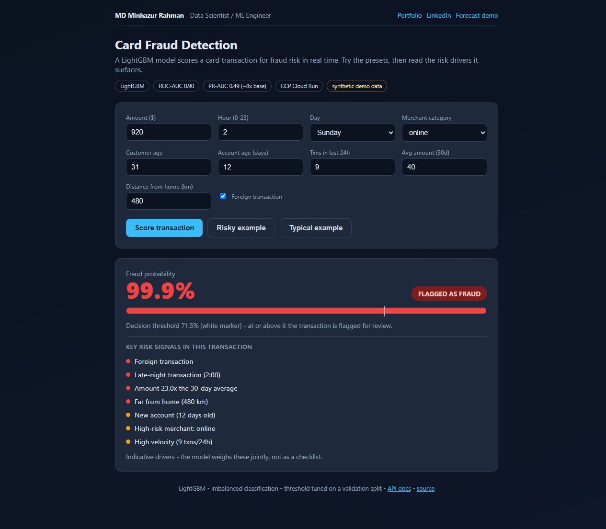
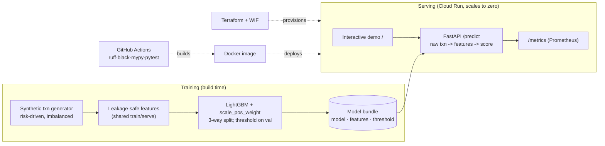

# fraud-detection-mlops

Real-time **card-fraud detection** — an imbalanced binary-classification MLOps
pipeline, built to the same typed / tested / CI / containerised / cloud-deployed
bar as my [retail-forecasting pipeline](https://github.com/minhazda/synthetic-retail-mlops-pipeline),
but on a deliberately different problem type (rare-event classification, not
forecasting) to show breadth.

> **Author:** Md Minhazur Rahman · MSc Data Science, University of Greenwich

## 🔴 Live demo (GCP Cloud Run)

**▶ Open https://fraud-detection-api-ude5vos6lq-uc.a.run.app/ in a browser** for an
interactive UI: enter a transaction (or use a preset) and get a fraud-probability
score, a decision against the tuned threshold, and the **risk signals that drove
it**. (Scales to zero — the first request after idle takes ~10s to wake.)



API endpoints: `/` (demo) · `/predict` · `/metadata` · `/health` · `/metrics` · `/docs`.

```bash
curl -X POST "https://fraud-detection-api-ude5vos6lq-uc.a.run.app/predict" \
  -H 'Content-Type: application/json' -d '{
  "rows": [{
    "amount": 920.0, "hour": 2, "day_of_week": 6, "merchant_category": "online",
    "customer_age": 31, "account_age_days": 12, "n_tx_24h": 9,
    "avg_amount_30d": 40.0, "distance_from_home": 480.0, "is_foreign": 1
  }]
}'
# -> {"fraud_probability":[0.999],"is_fraud":[true],"threshold":0.715}
```

## Architecture



## Why this project

Fraud is the canonical **imbalanced** problem: positives are a few percent of
traffic, so accuracy is meaningless and the real work is ranking quality,
threshold choice, and the precision/recall trade-off. This repo demonstrates
that end to end:

- **Deterministic synthetic generator** (`data/generate.py`) where fraud is a
  logistic function of genuine risk signals (night-time, risky merchant
  category, amount vs the customer's own average, foreign / far-from-home, new
  account, transaction velocity) plus noise — real signal (Bayes-optimal ROC-AUC
  ~0.93), not trivially separable.
- **Leakage-safe features** (`features.py`) shared by training and serving, so
  the API engineers features from **raw transactions** with no train/serve skew.
- **Imbalance-aware training** (`train.py`): LightGBM with `scale_pos_weight`, a
  three-way stratified split (train / validation / test) so the operating
  **threshold is tuned on validation, never on test**.
- **Honest metrics** (`metrics.py`): ROC-AUC, **PR-AUC**, precision/recall/F1 at
  the chosen threshold, and the confusion matrix.

## Results

From a real run of `python -m fraud_detection.train` on the held-out test split
(regenerated on every image build; see [`models/metrics.json`](models/metrics.json)):

<!-- METRICS:START -->
| Metric | Value |
|--------|------:|
| ROC-AUC | **0.899** |
| PR-AUC (average precision) | **0.487** (≈ 8× the 0.060 base rate) |
| Precision @ threshold | 0.446 |
| Recall @ threshold | 0.531 |
| F1 @ threshold | 0.485 |
| Operating threshold (F1-optimal, tuned on validation) | 0.715 |
| Confusion (test) | TN 9000 · FP 397 · FN 283 · TP 320 |
| Fraud rate / sample size | 6.0% / 50,000 |
<!-- METRICS:END -->

PR-AUC is the headline for imbalanced data: at ~8× the base rate the model has
strong ranking power, and the threshold trades precision against recall where a
fraud team would want it (catch ~53% of fraud while keeping reviewer load sane).

## Engineering

| Area | Detail |
|------|--------|
| Quality | ruff · black · mypy · pytest — enforced in CI |
| Container | multi-stage, non-root, healthcheck; model trained at build so cold start is just load |
| Observability | Prometheus `/metrics` (HTTP + `fd_transactions_scored_total`, `fd_transactions_flagged_total`, `fd_fraud_probability`) |
| IaC / deploy | Terraform → Cloud Run; keyless CD via Workload Identity Federation |

## Quickstart

```bash
python -m venv .venv && . .venv/Scripts/activate   # or source .venv/bin/activate
pip install -r requirements-dev.txt && pip install -e .

python -m fraud_detection.train                    # train + write models/
uvicorn fraud_detection.api.main:app --reload      # serve on :8000
ruff check src tests && black --check src tests && mypy src && pytest
```

Or with Docker: `docker build -t fraud-detection . && docker run --rm -p 8000:8000 fraud-detection`.

Deployment details: [`terraform/`](terraform/) + the `deploy.yml` workflow.

## License

MIT © Md Minhazur Rahman
